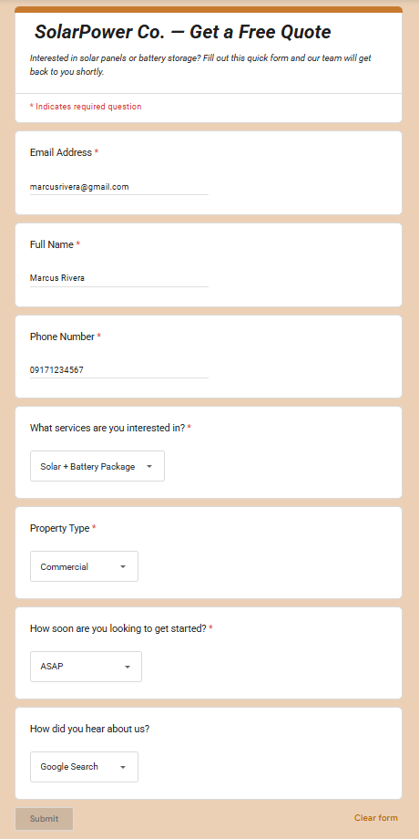
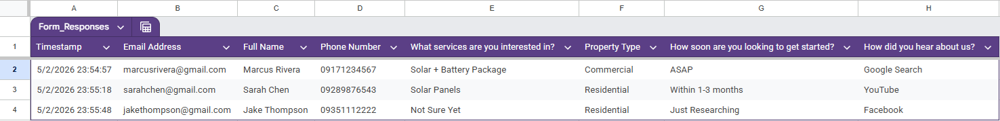
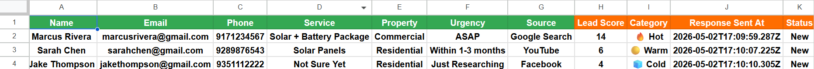

# ⚡ AI-Powered Lead Scoring & Qualification System

## 📌 Overview

This project simulates a real-world lead management system for a solar energy business.

It automates lead evaluation by assigning scores based on key criteria and classifying them into actionable categories, helping reduce manual filtering and improve response prioritization in sales workflows.

---

## 🚀 What This System Does

* Captures lead data from Google Forms
* Stores and processes data in Google Sheets
* Applies rule-based scoring logic
* Classifies leads (Hot / Warm / Cold)
* Outputs structured data for decision-making

---

## 🧠 System Output

### Input (Google Form)

### Input Data (Google Form Responses Sheet)

### After (Processed Leads Table)

### Automation Workflow

---

## 💡 Key Features

* Rule-based lead scoring system (simulates CRM logic)
* Automated classification (Hot / Warm / Cold)
* Structured data output for prioritization
* Scalable workflow for future automation (email, CRM, etc.)

---

## ⚙️ Tech Stack

* Google Forms
* Google Sheets
* Make (automation platform)
* Variable-based scoring logic

---

## 🏗️ How It Works

1. Leads submit their information via Google Form
2. Data is automatically stored in Google Sheets
3. Automation processes lead attributes:

   * Service interest
   * Property type
   * Urgency level
4. System calculates a lead score
5. Leads are categorized into:

   * 🔥 Hot
   * 🟡 Warm
   * 🧊 Cold
6. Results are written back to the sheet

---

## 🎯 Purpose

This project demonstrates:

* Automation workflow design
* Lead qualification systems
* Business logic implementation
* Data processing and decision systems

## 📈 Business Impact

- Reduces lead response time from manual review to near-instant classification  
- Helps prioritize high-value leads for faster conversion  
- Simulates CRM-style lead qualification used in sales pipelines

---

## 📊 Scoring Logic (Summary)

* Service (1–5 points)
* Property Type (2–4 points)
* Urgency (1–5 points)

**Total Score → Category**

* 10–14 → 🔥 Hot
* 6–9 → 🟡 Warm
* 4–5 → 🧊 Cold

---

## 📂 Project Structure

* `/screenshots` → Before & After outputs
* `/docs` (optional) → Workflow explanation

---

## 👤 Author

Jonathan – Aspiring Tech VA focused on automation, AI workflows, and data systems.
